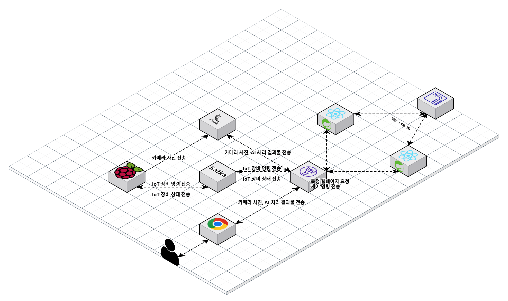

<h1 align="center">스마트 물류 자동화 시스템 프로젝트 👍</h1>

<center>
    
</center>

> [한국품질재단] 프로젝트 기반 ICT 융합 스마트팩토리 전문가 양성과정 / 1팀

🎬[Demo 시연영상](https://www.youtube.com/watch?v=dhMrKTwNI8U&lc=UgzCJR3WxkvsckRyyO94AaABAg&ab_channel=%EB%94%B0%EB%9D%BC%ED%95%98%EB%A9%B4%EC%84%9C%EB%B0%B0%EC%9A%B0%EB%8A%94IT)  
🎤[발표](https://www.youtube.com/watch?v=dhMrKTwNI8U&lc=UgzCJR3WxkvsckRyyO94AaABAg&ab_channel=%EB%94%B0%EB%9D%BC%ED%95%98%EB%A9%B4%EC%84%9C%EB%B0%B0%EC%9A%B0%EB%8A%94IT)  
📃[프로젝트 회고록](블로그주소)

<br>

## ✨ 프로젝트 설명

스마트 물류 자동화 시스템은 컨베이어 벨트에 설치된 카메라가 물류의 QR코드를 인식하여 자동으로 물류를 분류하고 적재하는 서비스입니다.이 시스템은 물류 작업을 자동화하고 효율성을 향상시키며, 물류 추적 및 관리를 간편하게 수행할 수 있습니다. QR코드 인식을 통해 물류 정보를 실시간으로 수집하고 데이터베이스에 저장하여 효과적인 물류 관리가 가능합니다.

## 🎬 [데모 사이트](http://스마트물류자동화.메인.한국) <- 클릭하면 이동됩니다!

```sh
현재는 AWS 프론트엔드, 백엔드, RDS로 배포한 상태입니다.
```

## 📌 기술 선정 이유

- React
  => React는 널리 사용되는 JavaScript 라이브러리로, 커뮤니티와 생태계가 크고 활발합니다. 사용자 인터페이스를 구축하고 관리하기 위한 강력한 도구로 React를 선택했습니다.

- Springboot
  => Spring Boot는 자바 기반의 웹 애플리케이션 개발을 단순화하고 생산성을 향상시키는 프레임워크입니다. 많은 개발자들이 Spring Boot를 사용하고 있어 안정성과 지원이 확실한 기술을 선택했습니다.

- RasberryPi4(Python)
  => Python은 Raspberry Pi에서 사용하기에 편리하며 많은 개발자가 활용하고 있습니다.

- AI(Python)
  => Python은 데이터 과학, 기계 학습 및 딥러닝 분야에서 매우 인기 있는 언어로, 다양한 라이브러리와 프레임워크를 지원합니다. 또한 Python 커뮤니티와 생태계가 활발하며, 많은 개발자들이 Python을 활용하고 있습니다.

## 📌 프로젝트 목표

```sh
Python 및 OpenCV: Python과 OpenCV를 사용하여 IoT 장비의 카메라 모듈에서 이미지를 캡처하고 QR 코드를 실시간으로 인식합니다. IoT 장비의 컨베이어 벨트와 로봇팔을 제어합니다.

Spring Boot: Spring Boot를 사용하여 백엔드 서버를 개발하고, 데이터베이스와의 상호 작용을 단순화하여 물류 정보를 저장하고 관리합니다.

Apache Kafka: Apache Kafka를 활용하여 IoT 장비와 백엔드 서버 간의 메시지 통신을 구현하며, 장비의 상태 메세지 및 제어 명령 메세지를 전송합니다.

웹소켓 (WebSocket): 웹소켓을 사용하여 실시간으로 프론트엔드와 백엔드 서버 간의 메세지를 전달하고, 장비 상태를 모니터링하고 제어합니다.
```

## 🔍 Overview

### 1. QR 코드로 물류 인식

<center>
    
</center>

```sh
AI Server에서 QR코드 인식 및 처리를 합니다.

QR코드 인식 후 DB에 저장 및 컨베이어벨트, 로봇팔 작동을 작동합니다.
```

<br>

### 2. IoT 장비 제어

<center>
    
</center>

```sh
Websocket으로 백엔드에게 IoT 장비 명령 메시지 전달합니다.

Kafka로 프론트엔드에서 받은 메시지 IoT 장비에게 메시지 전달합니다.
```

<br>

### 3. DB에 저장된 상품목록 수정 및 삭제 가능

<center>
    
</center>

```sh
백엔드 API를 사용하여 DB에 저장된 상품목록을 수정하거나 삭제할 수 있습니다.
```

<br>

## System Architecture

<center>
    
</center>
대용량 트래픽을 고려한 서버 이중화

<br>

## 🔧 각 프로젝트 상세 설명

### [프론트 엔드 github](https://github.com/LUKR7Q/frontI5) <- 클릭하면 이동됩니다!

### [백 엔드 github](https://github.com/I5BrilliantStar/Backend) <- 클릭하면 이동됩니다!

### [인공지능 github](https://github.com/I5BrilliantStar/AIServer) <- 클릭하면 이동됩니다!

### [IoT github](https://github.com/I5BrilliantStar/IoT) <- 클릭하면 이동됩니다!

## 🤼‍♂️팀원

Team Leader : 🐯**김용범**

Backend : 🐶 **유창훈**

Frontend : 🐱 **김용범 박지훈**

인공지능 : 🦁 **유창훈**

IoT : 🐺 **박이건**
